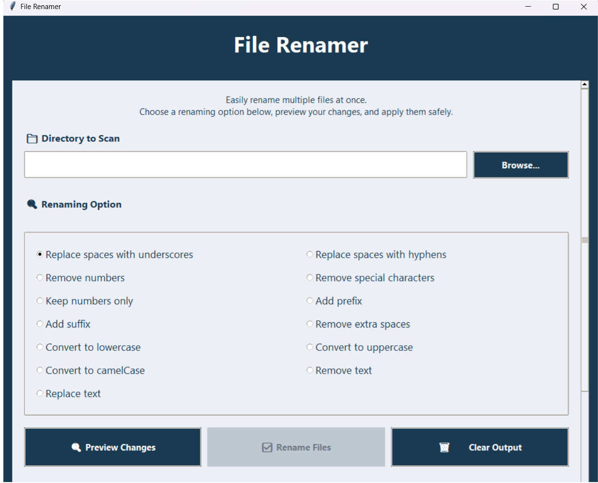
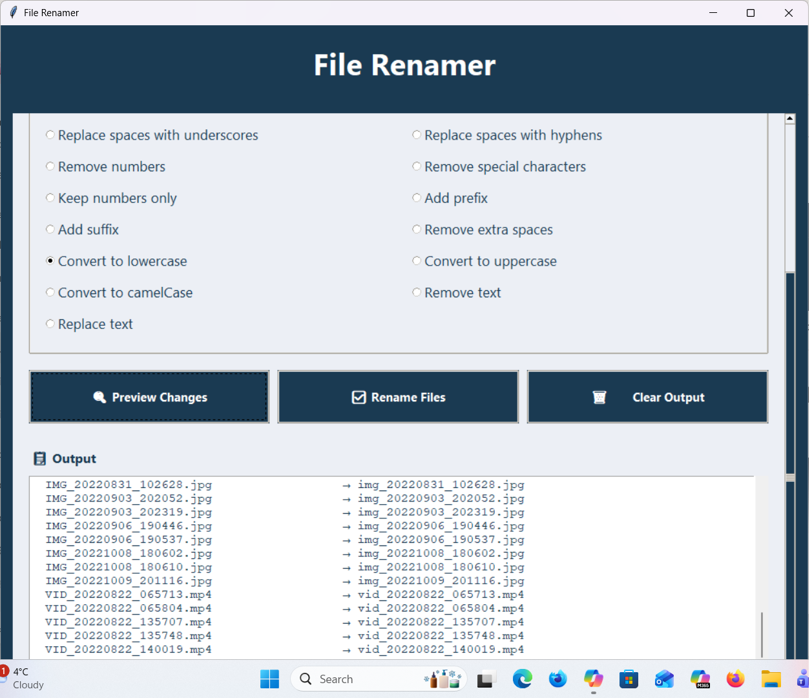

**# python_file_renamer_gui**

A safe, user-friendly bulk file renamer built with Python and Tkinter.

**File Renamer (Python + Tkinter)**

A modern, GUI-based file renaming tool built in Python and Tkinter.
Designed for non‑technical users, it provides safe bulk renaming with previews, collision detection, and a clean, responsive interface.

✨ Features

- 🔍 Preview before renaming
- 🛡️ Collision detection (prevents accidental overwrites)
- 🚫 Illegal character protection
- ✏️ Replace or remove text
- ➕ Add prefix or suffix
- 🔤 Case conversion (lowercase, UPPERCASE, Camel Case)
- 🔢 Remove numbers
- 🔧 Replace spaces with underscores or hyphens
- 🎨 Modern, user-friendly UI

🖼️ Screenshots

### Main Window

### Preview Window

🧩 How to Use

- Select a folder containing the files you want to rename
- Choose a renaming option
- Enter any required text (prefix, text to replace, etc.)
- Click Preview Changes
- Review the results
- Click Rename Files to apply the changes

🛠️ Installation

Run from source
Requires Python 3.10+.
pip install -r requirements.txt
python file_renamer.py

Standalone EXE (coming soon)

I plan to package the app using PyInstaller and publish a downloadable Windows executable.

📚 What I Learned

This project helped me deepen my skills in:
- Python GUI development (Tkinter)
- Regex pattern design
- File handling and OS‑level safety
- UX design for non‑technical users
- Defensive programming and edge‑case handling
- Structuring maintainable code
- Debugging subtle state‑bleed issues
- Designing clear, friendly error messages

🧭 My Development Journey

I built this tool while balancing a full‑time role and family life, and it became a great reminder that consistent, focused effort leads to real progress.
One thing I didn’t do on this project — but will on the next — is use GitHub from day one to track progress.
This repo marks the start of that habit.

🔮 Future Improvements

- Undo support
- More case styles (PascalCase, snake_case)
- Recursive folder scanning
- Drag‑and‑drop support
- Dark mode
- Packaged EXE release

📄 License
MIT License — free to use, modify, and share.
